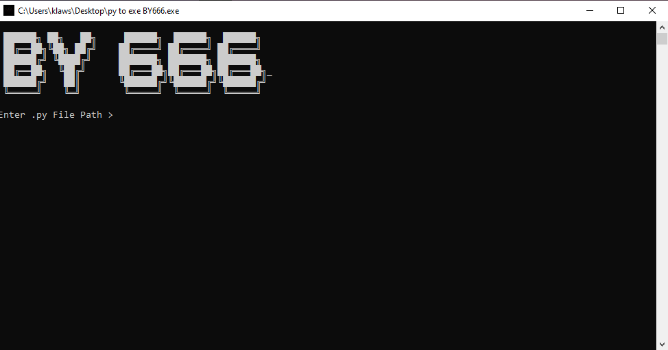

<h1 align="center">🐍 Py To EXE</h1>

  Convert your Python scripts into standalone Windows executables with ease.

  
  
  

---

# 👨‍💻 Developer

- **ABO 3TB**
- **GitHub:** https://github.com/BO-3TB
- **Discord:** `pn.4`
- **Guns.lol:** https://guns.lol/666.x666

---

## 🖼️ Preview

---

# ✨ Features

- 🐍 Built with Python
- ⚡ Fast & Lightweight
- 📦 Convert Python (.py) files to Windows (.exe)
- 🖼️ Custom EXE Icon Support (.ico)
- 🖥️ Console & Windowed Mode
- 📁 User Friendly Interface
- 🚀 One Click Build

---

# 📥 Download

Download the latest release from this repository.

After downloading:

1. Open **Py To EXE.exe**
2. Select your Python file.
3. Configure your build settings.
4. Click **Build**.
5. Your executable will be generated automatically.

> **Python is not required to run the executable.**

---

# 📂 Files

- 📁 images/
- 🖼️ py_to_exe_tool.png
- 🚀 Py To EXE.exe
- 📄 README.md
- 📄 LICENSE

---

# 💻 Built With

- Python
- PyInstaller
- Custom GUI

---

# ⭐ Support

If you enjoy this project, please leave a ⭐ on GitHub.

---

Made with ❤️ by <b>ABO 3TB⁶⁶⁶</b>

